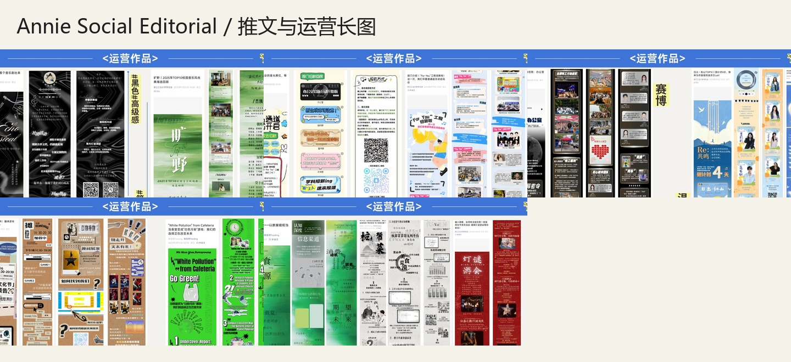
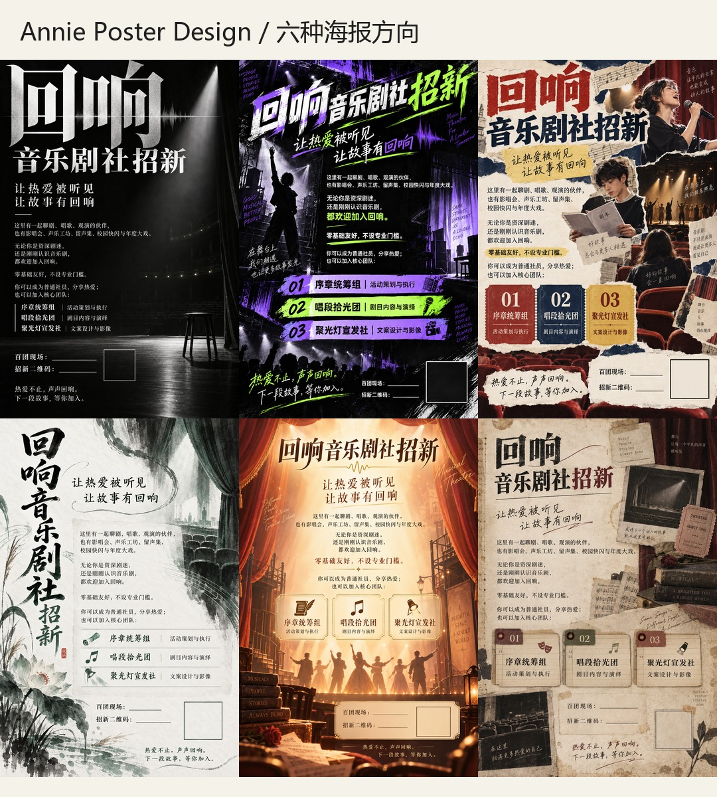
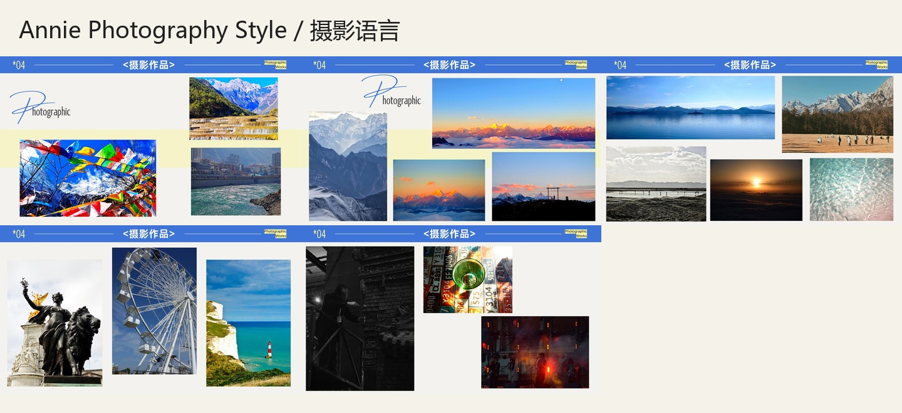
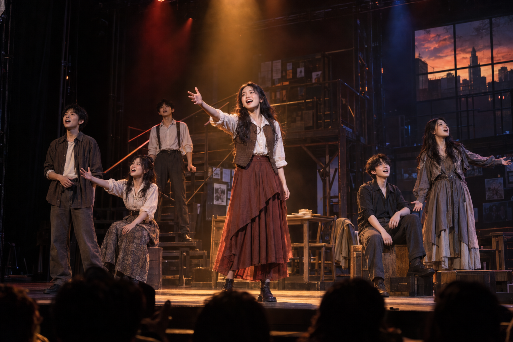
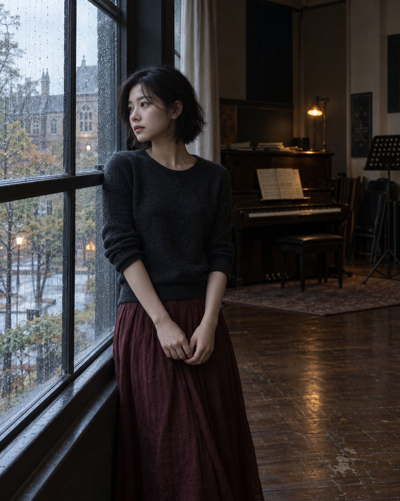
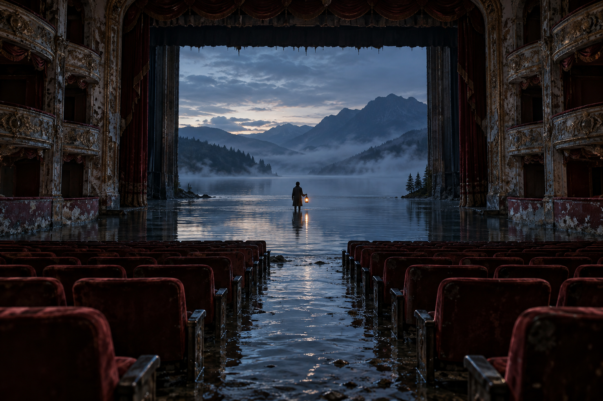

# Annie Creative Skills

一组从 Annie 个人作品集中提炼的 Codex 设计技能，覆盖推文与运营长图、海报设计、摄影风格和跨媒介创意统筹。

这套技能不把个人风格简化成固定配色。它关注的是：如何根据主题选择审美方向、建立信息层级、组织视觉叙事，并在不同媒介中保持鲜明但灵活的创作判断。

## Skills

| Skill | 用途 |
| --- | --- |
| [`annie-social-editorial`](skills/annie-social-editorial) | 推文、运营长图、招新介绍、活动复盘、调研与科普 |
| [`annie-poster-design`](skills/annie-poster-design) | 海报、主视觉、招新视觉与活动宣传 |
| [`annie-photography-style`](skills/annie-photography-style) | 拍摄方案、选片、调色、摄影组图与照片呈现 |
| [`annie-portfolio-style`](skills/annie-portfolio-style) | 跨媒介项目统筹与专业 Skill 路由 |

## Demo

### 推文与运营长图



### 多风格海报



### 摄影语言



#### 摄影生成示例

以下作品使用 `annie-photography-style` 提供摄影方向，再以 AI 图像生成完成。它们用于展示 Skill 如何根据不同题材切换空间、光线与色彩判断，而不是套用同一滤镜。

**舞台摄影｜红橙主光、蓝色轮廓光与观众前景**



**风景摄影｜雨后山湖、雾中层次与微小人物尺度**


**人物摄影｜雨窗自然光、旧排练室与克制冷暖关系**



**超现实摄影｜剧场、湖面与远山的真实空间错位**



## 设计方向

### 推文

- 黑银音乐与剧场
- 活力校园招新
- 温柔蓝黄人物故事
- 复古票据与公告板拼贴
- 荧光绿色议题视觉
- 中式水墨研究叙事
- 音乐剧杂志式推荐

### 海报

- 黑白剧场
- 赛博碰撞
- 编辑拼贴
- 植物水墨
- 橙金舞台
- 复古剧单与阅读档案

### 摄影

- 宏大风光与空间层次
- 日照金山与冷暖光线
- 旅行地标与建筑几何
- 自然中的高饱和色彩
- 低调黑白空间
- 夜间舞台红光
- 旅行静物与纹理
- 环境人物与自然光叙事
- 基于真实摄影语言的超现实空间

## 安装

将需要的 Skill 文件夹复制到 Codex Skills 目录：

```text
~/.codex/skills/
```

例如：

```text
~/.codex/skills/annie-poster-design/
```

重新打开 Codex 后即可通过 `$annie-poster-design` 等名称调用。

## 调用示例

```text
使用 $annie-poster-design，为校园音乐节设计一张招新海报。
```

```text
使用 $annie-social-editorial，把这份活动策划整理成微信公众号长图。
```

```text
使用 $annie-photography-style，为这次山地旅行制定拍摄和选片方案。
```

## Repository structure

```text
annie-creative-skills/
├── demos/
├── scripts/
└── skills/
    ├── annie-photography-style/
    ├── annie-portfolio-style/
    ├── annie-poster-design/
    └── annie-social-editorial/
```

## Notes

- 演示图用于说明 Skill 的视觉覆盖范围。
- 正式项目仍应依据实际主题、受众和载体选择艺术方向。
- 本仓库当前未声明开源许可证；未经许可，不代表自动获得复制、修改或商业使用授权。
